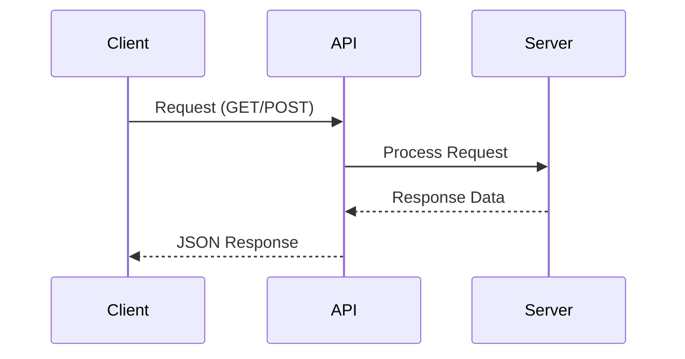
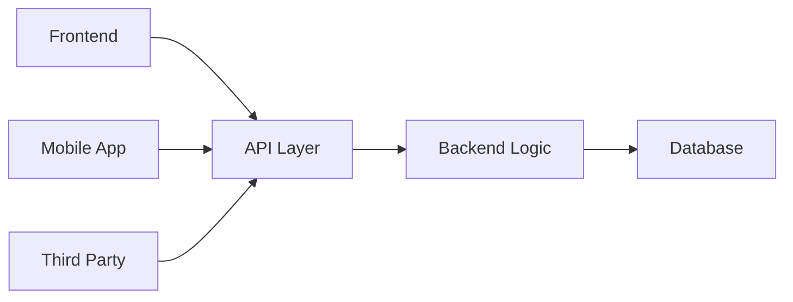
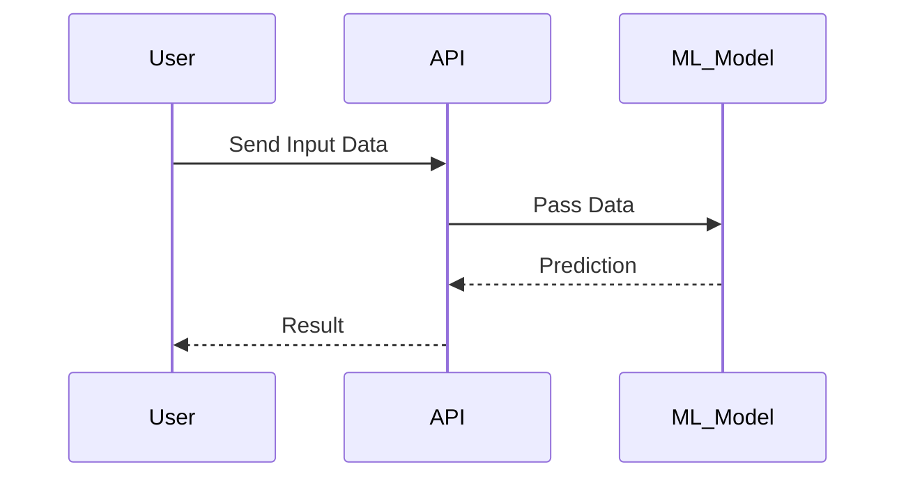

# 📘 FastAPI Documentation – API Fundamentals

## 📌 Introduction

Before jumping into FastAPI, you need to understand what an API actually is and why it matters.

Most beginners rush into writing endpoints without understanding the *purpose*. That’s a mistake.

If you don’t understand APIs, you’re just copying syntax, not building systems.

---

## 🔹 What is an API?

**API (Application Programming Interface)** is a way for two systems to talk to each other.

Think of it like a waiter in a restaurant:

* You → Client (Frontend / User)
* Kitchen → Server (Backend)
* Waiter → API

You don’t go inside the kitchen.
You give an order → waiter → kitchen → food comes back.

That “communication layer” is the API.

---

## 🔹 Basic Flow of an API



---

## 🔹 Need for APIs

Let’s be real: without APIs, modern software doesn’t exist.

### Why APIs are needed:

1. **Separation of Frontend & Backend**

   * UI and logic are independent
   * You can change frontend without touching backend

2. **Scalability**

   * Same API can serve:

     * Web app
     * Mobile app
     * Third-party apps

3. **Reusability**

   * Write logic once, use everywhere

4. **Integration**

   * Connect payment gateways, maps, AI models, etc.

---

## 🔹 Systems: With API vs Without API

### ❌ Without API (Tightly Coupled System)


Problems:

* Everything is tightly connected
* Hard to scale
* Hard to maintain
* No external access

---

### ✅ With API (Decoupled System)



Advantages:

* Clean architecture
* Multiple clients supported
* Easy scaling
* Industry standard approach

---

## 🔹 API in Software Development

In real-world software, APIs are the backbone.

### Example:

* Login system → `/login`
* Get user data → `/users/{id}`
* Upload file → `/upload`

### Types of APIs:

| Type     | Description                   |
| -------- | ----------------------------- |
| REST API | Most common (used in FastAPI) |
| GraphQL  | Flexible querying             |
| SOAP     | Old, heavy, rarely used now   |

---

## 🔹 API Request Example

```http
GET /users/1
```

Response:

```json
{
  "id": 1,
  "name": "Akshit",
  "email": "akshit@email.com"
}
```

---

## 🔹 API in Machine Learning Models

This is where things get interesting.

ML models are useless unless exposed via APIs.

### Without API:

* Model sits in a notebook
* No one can use it

### With API:

* Model becomes a service

---

### ML API Flow



---

### Example: ML Prediction API

Request:

```json
POST /predict

{
  "age": 25,
  "income": 50000
}
```

Response:

```json
{
  "prediction": "Approved"
}
```

---

## 🔹 Why FastAPI for APIs?

Now connecting this to FastAPI:

* Fast (built on ASGI)
* Easy to write
* Automatic docs (Swagger UI)
* Perfect for ML deployment

---

## 🔥 Reality Check

If your goal is **data science + ML engineer**, then:

* Just training models is not enough
* You must **serve models using APIs**
* FastAPI is one of the best tools for that

If you skip APIs, you’re not industry-ready. Simple.

---

## 📌 Summary

* API = communication bridge between systems
* Required for scalability, flexibility, integration
* Used everywhere in software & ML
* FastAPI is used to build these APIs efficiently

---