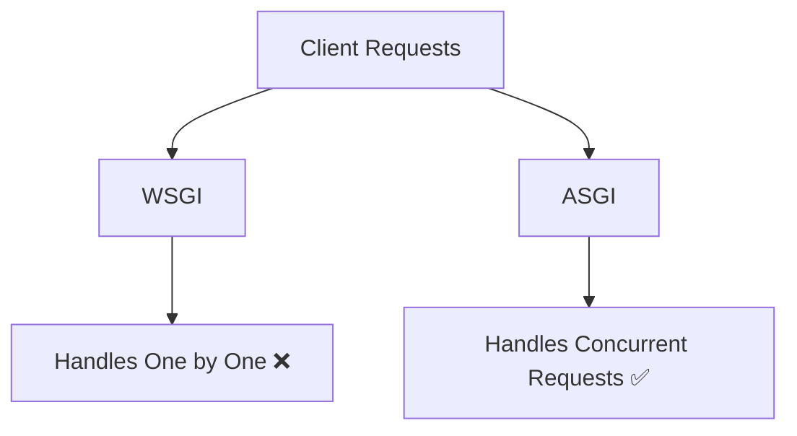
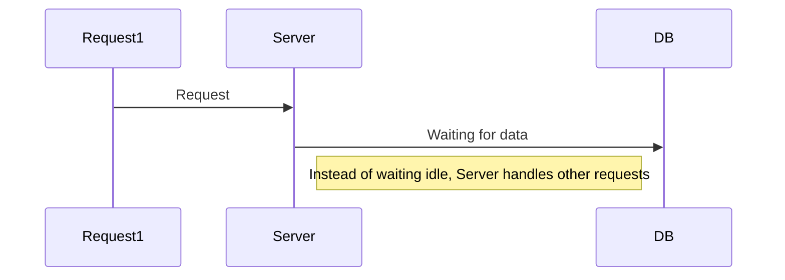

# 📌 Introduction to FastAPI

**FastAPI** is a modern Python web framework used to build APIs.

It is designed for:

* High performance (very fast)
* Easy development
* Clean, readable code

It’s widely used for:

* Backend services
* ML model deployment
* Microservices

---

## 🔹 Big Picture: How Web Software Works

Before FastAPI, understand where it sits.


👉 FastAPI is **not the server**, not the database
👉 It’s the **framework where you write logic**

---

## 🔹 What is ASGI?

**ASGI**

ASGI is a standard that allows async communication between:

* Web server
* Python application

### Why ASGI matters:

* Supports **async / await**
* Handles multiple requests at once
* Required for modern high-performance apps

---

## 🔹 What is WSGI?

**WSGI**

Older standard used by frameworks like Django/Flask.

### Limitation:

* Only synchronous (one request at a time per worker)
* Not efficient for real-time or high-load systems

---

## 🔹 ASGI vs WSGI



| Feature    | WSGI             | ASGI                   |
| ---------- | ---------------- | ---------------------- |
| Type       | Sync             | Async                  |
| Speed      | Slower           | Faster                 |
| Use Case   | Traditional apps | Modern APIs, real-time |
| Frameworks | Flask, Django    | FastAPI, Starlette     |

---

## 🔹 Async & Await (Core Concept)

If you ignore this, you’ll never understand why FastAPI is fast.

### ❌ Without async:

```python
def get_data():
    data = slow_db_call()
    return data
```

👉 Blocks everything until done

---

### ✅ With async:

```python
async def get_data():
    data = await slow_db_call()
    return data
```

👉 While waiting, server handles other requests

---

### Mental Model:


---

## 🔹 Starlette (Hidden Engine)

**Starlette**

FastAPI is built on top of Starlette.

### What Starlette provides:

* Routing
* Middleware
* Request/Response handling
* ASGI support

👉 FastAPI = Starlette + extra features

---

## 🔹 Pydantic (Data Validation Power)

**Pydantic**

Used for:

* Data validation
* Type checking
* Automatic parsing

### Example:

```python
from pydantic import BaseModel

class User(BaseModel):
    name: str
    age: int
```

👉 If wrong data comes → automatic error
👉 No manual validation needed

---

## 🔹 Philosophy of FastAPI

FastAPI is built on these principles:

### 1. Type-driven development

* You define types → FastAPI handles validation

### 2. Developer speed

* Less boilerplate
* More productivity

### 3. Performance

* Near Node.js / Go speed

### 4. Automatic docs

* Swagger UI generated automatically

---

## 🔹 Why FastAPI is Fast to Run

Let’s break it honestly.

### Reasons:

1. **ASGI-based**

   * Handles multiple requests concurrently

2. **Async support**

   * Doesn’t block execution

3. **Starlette core**

   * Lightweight and optimized

4. **Uvicorn server**

   * High-performance ASGI server

👉 Result: Handles more requests with less resources

---

## 🔹 Why FastAPI is Fast to Code

This is where beginners underestimate it.

### Reasons:

1. **Type hints = validation + docs**

   * Write once → multiple benefits

2. **Less boilerplate**

   * No need for serializers, forms, etc.

3. **Auto API docs**

   * No manual documentation

4. **Cleaner structure**

---

### Example (Real Simplicity)

```python
from fastapi import FastAPI

app = FastAPI()

@app.get("/")
def read_root():
    return {"message": "Hello World"}
```

👉 That’s a working API. No extra setup.

---

## 🔹 Reality Check (Important)

If you:

* Don’t understand async
* Don’t understand request flow
* Don’t understand ASGI

Then FastAPI will feel “easy” but you’ll break in real projects.

---

## 📌 Summary

* FastAPI = modern API framework
* Built on Starlette + Pydantic
* Uses ASGI (not WSGI)
* Async makes it fast
* Type hints reduce effort

---

## 🚀 What You Should Do Now

Don’t just read this.

👉 Do this immediately:

1. Install FastAPI + Uvicorn
2. Run a basic server
3. Hit endpoint in browser

---