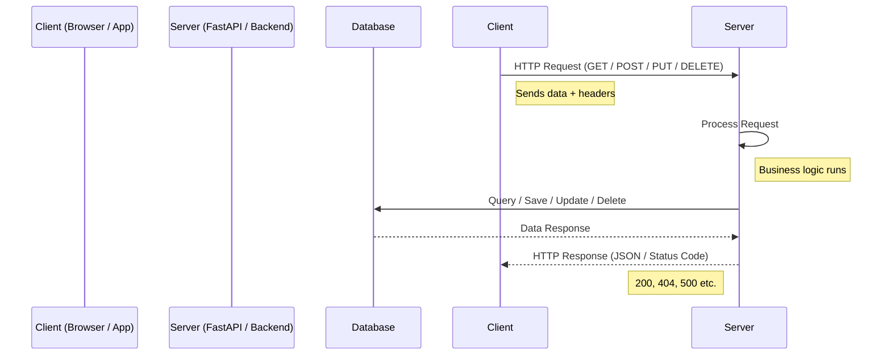
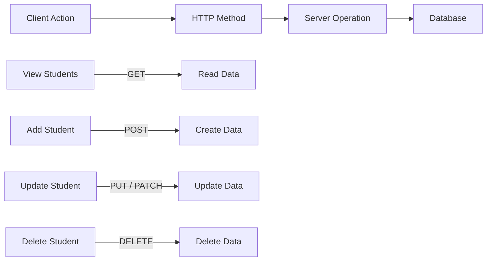

# 🌐 HTTP Methods

## 🌐 HTTP Request–Response Flow (Client → Server)



---

## 🔥 What’s REALLY happening (no fluff)

* Client = browser / mobile app / frontend
* Server = your FastAPI app
* HTTP Request = “hey server, do this”
* HTTP Response = “done, here’s result”

---

# 📦 Structure of HTTP Request

```text
GET /students HTTP/1.1
Host: example.com
Authorization: Bearer token

Body (optional)
```

---

# 📤 Structure of HTTP Response

```text
HTTP/1.1 200 OK
Content-Type: application/json

{
    "message": "success",
    "data": [...]
}
```

---

# 🧠 HTTP Methods mapped to CRUD

Stop memorizing blindly. Understand intent.

| HTTP Method | CRUD Operation   | Meaning (Real World)  |
| ----------- | ---------------- | --------------------- |
| GET         | Read             | Fetch data            |
| POST        | Create           | Add new data          |
| PUT         | Update (full)    | Replace entire data   |
| PATCH       | Update (partial) | Update specific field |
| DELETE      | Delete           | Remove data           |

---

## 🔁 CRUD Mapping Diagram



---

# 💻 FastAPI Example (Reality Check)

```python
from fastapi import FastAPI

app = FastAPI()

# READ
@app.get("/students")
def get_students():
    return {"students": []}

# CREATE
@app.post("/students")
def create_student(student: dict):
    return {"msg": "student created"}

# UPDATE
@app.put("/students/{id}")
def update_student(id: int):
    return {"msg": "student updated"}

# DELETE
@app.delete("/students/{id}")
def delete_student(id: int):
    return {"msg": "student deleted"}
```

---

# ⚠️ Where most beginners mess up (including you if not careful)

* Thinking **HTTP methods = just syntax** → WRONG
  → They define **intent + API design**

* Using `GET` to send data → BAD practice

* Using `POST` for everything → lazy design

* Not understanding status codes → weak backend skills

---

# 🧠 Final Mental Model

Think like this:

> Client = “What I want”
> HTTP Method = “What action”
> Server = “How to do it”
> Database = “Where data lives”

---