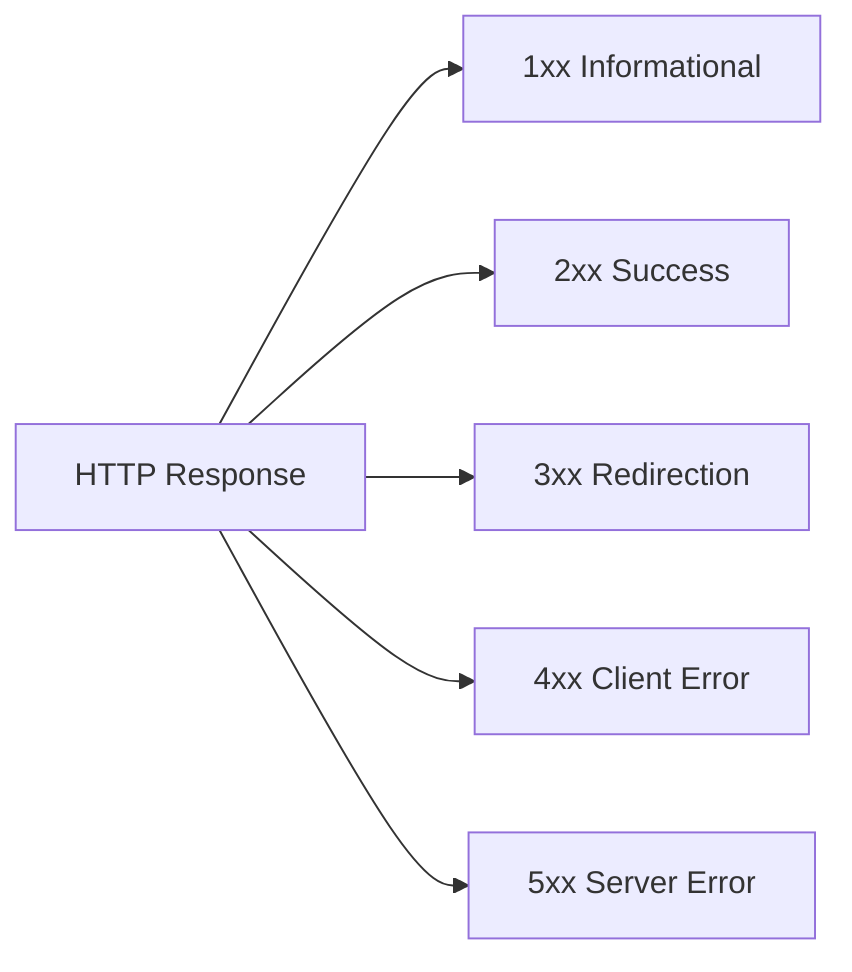

# 📡 HTTP Status Codes (Real Understanding)

Every response from server comes with a **status code**:

> It tells: **request successful, failed, or something else happened**

---

# 🔢 Status Code Categories (Big Picture)



---

# ✅ 2xx — Success (Everything worked)

These are the only codes you *want most of the time*.

| Code | Meaning    | When used                    |
| ---- | ---------- | ---------------------------- |
| 200  | OK         | Data fetched successfully    |
| 201  | Created    | New resource created         |
| 204  | No Content | Success but no data returned |

### Example:

```json
{
  "message": "Student fetched successfully"
}
```

---

# ❌ 4xx — Client Errors (Your mistake)

This is where YOU messed up.

| Code | Meaning      | Reality                |
| ---- | ------------ | ---------------------- |
| 400  | Bad Request  | Wrong input format     |
| 401  | Unauthorized | Not logged in          |
| 403  | Forbidden    | No permission          |
| 404  | Not Found    | Resource doesn’t exist |

### Brutal truth:

If you're getting 4xx → **your frontend or request is wrong**

---

# 💥 5xx — Server Errors (Backend failure)

Now it’s your backend’s fault.

| Code | Meaning               | Reality        |
| ---- | --------------------- | -------------- |
| 500  | Internal Server Error | Code crashed   |
| 502  | Bad Gateway           | Upstream error |
| 503  | Service Unavailable   | Server down    |

### Brutal truth:

If users see 500 → **your API is unreliable**

---

# 🔁 3xx — Redirection (Rare in APIs)

Mostly used in browsers, not much in APIs.

| Code | Meaning            |
| ---- | ------------------ |
| 301  | Moved Permanently  |
| 302  | Temporary Redirect |

---

# ℹ️ 1xx — Informational (Ignore for now)

Almost never used in real API dev.

---

# ⚙️ FastAPI Example (How you SHOULD use it)

```python
from fastapi import FastAPI, HTTPException

app = FastAPI()

@app.get("/student/{id}")
def get_student(id: int):
    if id != 1:
        raise HTTPException(status_code=404, detail="Student not found")
    
    return {"id": 1, "name": "Akshit"}
```

---

# 🧠 Real Developer Thinking

Stop thinking like:

> “Code chal raha hai ya nahi”

Start thinking like:

> “What status code should this situation return?”

---

# ⚠️ Common Mistakes (Don’t do this)

* Always returning `200` → **lazy and wrong**
* Not handling errors → **bad API design**
* Mixing 400 and 404 → shows confusion
* Ignoring status codes → you’ll struggle in real backend jobs

---

# 🧠 Simple Mental Map

| Situation     | Status Code |
| ------------- | ----------- |
| Data found    | 200         |
| Created new   | 201         |
| Not found     | 404         |
| Invalid input | 400         |
| Server crash  | 500         |

---