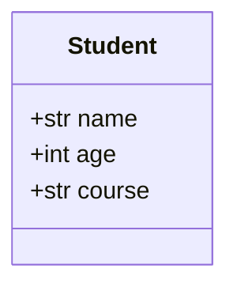
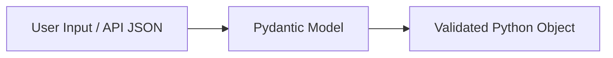
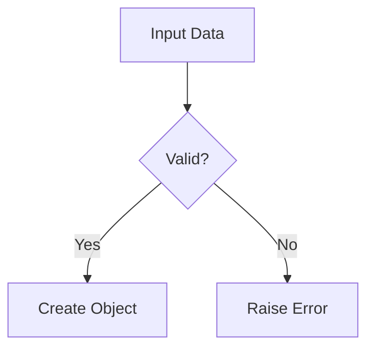

# ✅ 3 Steps to Write Pydantic Code

---

## 🔹 Step 1: Define a Model (Structure of Data)

You tell Python: *“This is what valid data should look like.”*

```python
from pydantic import BaseModel

class Student(BaseModel):
    name: str
    age: int
    course: str
```

### 🧠 What’s happening?

* You are **declaring a schema**
* Types (`str`, `int`) are **enforced at runtime**
* This replaces messy manual checks

---

### 📊 Diagram (Data Structure)



---

## 🔹 Step 2: Create Object (Pass Input Data)

Now you pass raw input (usually from API/user).

```python
student = Student(name="Akshit", age=22, course="Data Science")
print(student)
```

### 🧠 Reality check:

* Input can be **dict, JSON, API request**
* Pydantic automatically converts and validates

---

### 📊 Diagram (Input Flow)



---

## 🔹 Step 3: Validation Happens Automatically

If data is wrong → Pydantic throws error.

```python
student = Student(name="Akshit", age="twenty", course="DS")
```

❌ This will raise:

```
ValidationError: age is not a valid integer
```

---

### 📊 Diagram (Validation Logic)



---

# 🔥 With vs Without Pydantic (Reality)

## ❌ Without Pydantic (messy + risky)

```python
def create_student(data):
    if not isinstance(data.get("name"), str):
        raise ValueError("Invalid name")

    if not isinstance(data.get("age"), int):
        raise ValueError("Invalid age")

    return data
```

👉 Problems:

* Repetitive
* Easy to miss validation
* Not scalable

---

## ✅ With Pydantic (clean + scalable)

```python
from pydantic import BaseModel

class Student(BaseModel):
    name: str
    age: int

data = {"name": "Akshit", "age": 22}

student = Student(**data)
```

👉 Benefits:

* Auto validation
* Clean code
* Production-ready

---

# ⚠️ Brutal Truth (Don’t ignore this)

Most beginners:

* Think Pydantic = “just defining classes” ❌
* Ignore validation power ❌
* Don’t test invalid inputs ❌

👉 If you don’t **break your own model with bad data**, you’re not learning it properly.

---

# 🚀 What You Should Do Next

Don’t just read this. Do this:

1. Add constraints:

```python
from pydantic import BaseModel, Field

class Student(BaseModel):
    name: str
    age: int = Field(gt=0, lt=100)
```

2. Try invalid inputs intentionally
3. Use it inside FastAPI request body

---